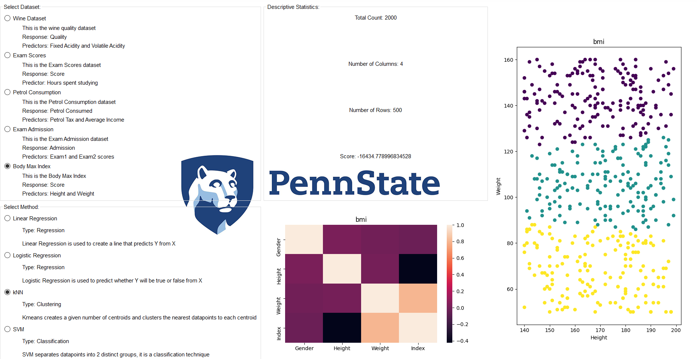

# ORDS
ORDS (Open Repository or Data Sciences) is a learning tool which gives an introduction to basic data science concepts. 

There are two ways a user can interact with this project. The first way is by running the source code directly. This gives the user an opportunity to learn how data science approaches within the project are being implemented behind-the-scenes. Additionally, the user can modify the existing source code or change the default arguments for certain parameters so there is some added control and flexibility with this option. We recommend running the `Docs.ipynb` first for users interested in this option. This file will need to be run with the **jupyter notebook** application. More instructions on how to do this are below.

The second way of interacting with this project is to use the GUI (graphical user interface) built on top of the source code. This does not involve any coding and is the best option for users who are less technical and do not have any prior coding experience. The tradeoff with this option however, is less control over the functionality of the program and the outputs will be simpler than what you would see by running the code directly. This was done intentionally since we wanted the GUI to be an option for users with a less technical background. This means that the implementations in the GUI are slighlty different than the implementations in the source code. You should keep this in mind when reading the Docs files since these act as documentation of the source code. For more information on how to use the GUI itself, you can watch this short video VIDEO LINK HERE.

## Requirements

There are several requirements for this project. To make sure you have the necessary packages installed, run the following command which will install the packages according to the configuration file `requirement.txt` 

`pip install -r requirements.txt`

## Running the Notebook

Jupyter notebook is a web-based notebook environment for interactive computing. It provides a convenient and easy-to-use interface by allowing a user to execute cells of code one-by-one and visualize the output. Installing it is easy. You can do some with the following commands.

First, ensure that you have the latest pip; older versions may have trouble with some dependencies:

`pip3 install --upgrade pip`

Then install the Jupyter Notebook using:

`pip3 install jupyter`

### Starting the Notebook Server

To start the notebook server run

`jupyter notebook`

You should see the notebook open in your browser.

### Opening a Specific Notebook

To open a specific notebook you can simply run (make sure you are in the same working directory as your notebook)

`jupyter notebook notebook.ipynb`

### Running the GUI (on Windows)

Click the `Capstone.exe` to run the GUI application on Windows.

### Building the GUI from source code

You will need a computer with python and all required packages. 

Mac: 

## Documentation

We offer documentation of the source code in two formats. The first format is a follow-along jupyter notebook (`Docs.ipynb`). The second is a pdf version of this notebook (`Docs.pdf`) for those who are interested in just reading about the source code rather than executing any of the code. The documentation goes over some basic machine learning terminology, typical data science workflows, and intuition behind how some of the algorithms in the project work. This is to be read if you are looking to dive deeper into the approaches and to understand how to exectute these functions. If you just want to play along with the GUI then this probably won't be of interest to you.
